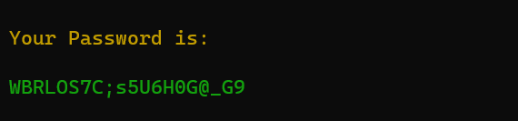

# Password Generator

Generates a password with three different levels of soft, medium, hard
and different lengths.

<div style="text-align: center;">
    
</div>

## How to Run

- First, you need to install the dependencies. You can do this by running the following command:
```
pip install -r requirements.txt
```

- Then add `src` to `PYTHONPATH`
```
export PYTHONPATH=$(pwd)
```

- Then run
```
python src/main.py level_of_pass length_of_pass